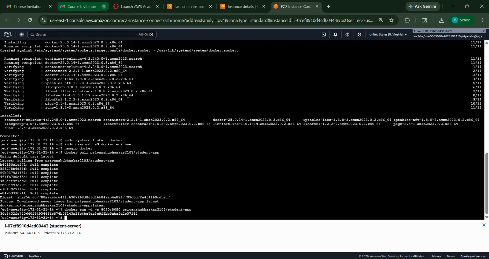

# 🚀 Dockerized Java WAR Application Deployment on AWS EC2

## 📌 Project Overview

This project demonstrates how to **containerize a Java WAR application** using Docker, push it to Docker Hub, and deploy it on an **AWS EC2 instance**.

The application is a simple **Student Form Web App** built using Java and deployed on Apache Tomcat inside a Docker container.

---

## 📸 Project Screenshot



---

## 🛠️ Tech Stack

* Java (WAR Project)
* Apache Tomcat
* Docker
* AWS EC2
* Docker Hub

---

## 📂 Project Structure

* `Dockerfile` → Used to build Docker image
* `student-form.war` → Java web application
* `README.md` → Project documentation
* `image.png` → Application screenshot

---

## ⚙️ Steps Performed

### 1️⃣ Docker Image Creation

* Created Dockerfile using Tomcat base image
* Copied WAR file into Tomcat webapps directory
* Built Docker image

```bash
docker build -t student-app .
```

---

### 2️⃣ Push Image to Docker Hub

```bash
docker tag student-app priyanshubhaskar2103/student-app
docker push priyanshubhaskar2103/student-app
```

---

### 3️⃣ AWS EC2 Setup

* Launched EC2 instance (Amazon Linux)
* Configured security group:

  * Port 22 (SSH)
  * Port 80 (HTTP)
  * Port 8080 (Application)

---

### 4️⃣ Install Docker on EC2

```bash
sudo yum update -y
sudo yum install docker -y
sudo systemctl start docker
sudo usermod -aG docker ec2-user
```

---

### 5️⃣ Deploy Application on EC2

```bash
docker pull priyanshubhaskar2103/student-app
docker run -d -p 8080:8080 priyanshubhaskar2103/student-app
```

---

## 🌐 Application Access

Access the app in browser:

```
http://<EC2-Public-IP>:8080
```

Example:

```
http://54.164.149.9:8080
```

---

## ✅ Result

* Successfully deployed Dockerized Java WAR application on AWS EC2
* Application accessible via public IP

---

## 📚 Learning Outcome

* Docker image creation and management
* Docker Hub integration
* AWS EC2 deployment
* Real-world DevOps workflow

---

## 🙌 Author

**Priyanshu Bhaskar**

---

## ⭐ Note

This project is part of a DevOps learning assignment demonstrating end-to-end deployment using Docker and AWS.
